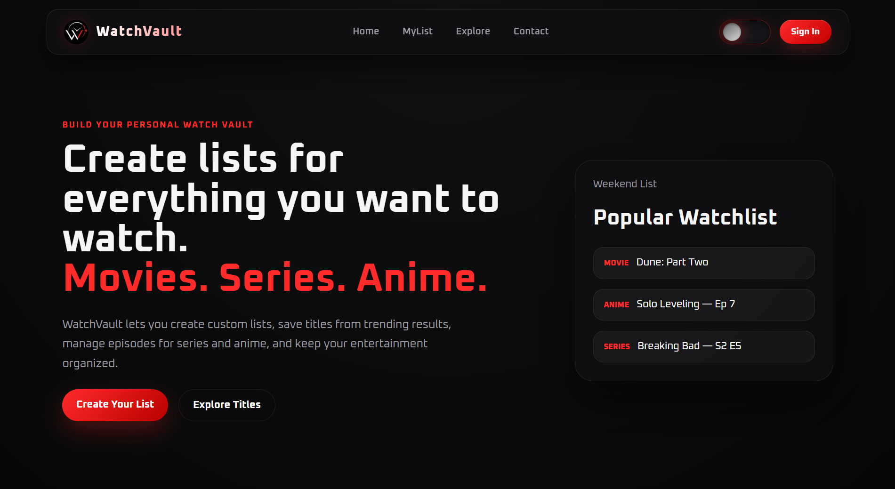
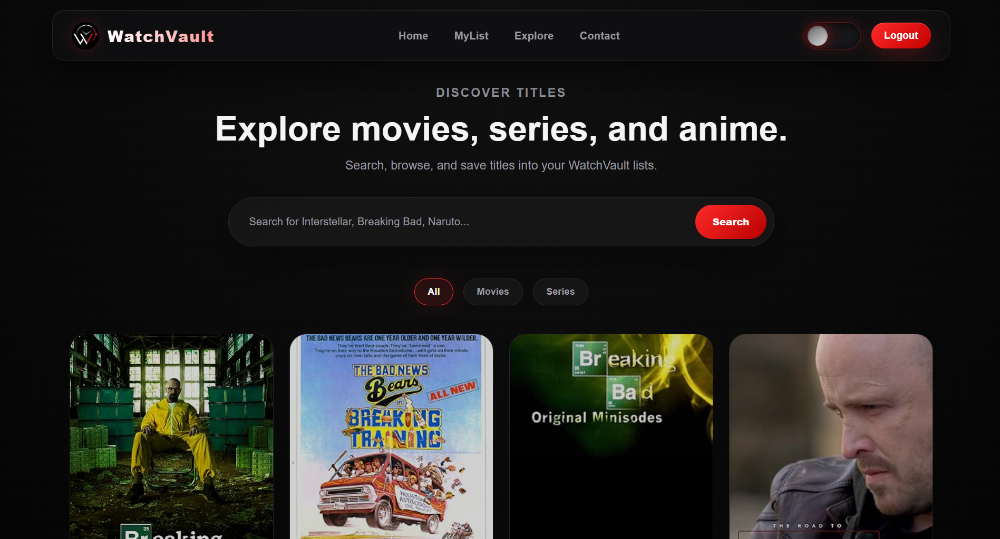
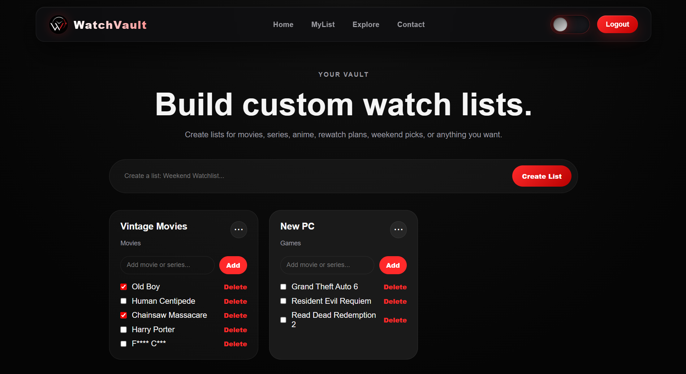

<div align="center">


# WatchVault

**Build your personal watch vault.**  
Create lists for everything you want to watch — Movies, Series, Anime.

[](https://watch-vault--joshuabaskar106.replit.app/)
[](https://nodejs.org/)
[](https://www.mongodb.com/)

[](https://developer.mozilla.org/en-US/docs/Web/HTML)
[](https://developer.mozilla.org/en-US/docs/Web/CSS)
[](https://developer.mozilla.org/en-US/docs/Web/JavaScript)

🌐 **Live App:** [watch-vault--joshuabaskar106.replit.app](https://watch-vault--joshuabaskar106.replit.app/)

</div>

---

## About

WatchVault is a full-stack web application for organizing personal entertainment. Rather than passive logging, it gives users full control through custom lists and flexible collection management — whether queuing a weekend watchlist, tracking series progress, or sorting anime by season.

>WatchVault is not a streaming platform. It is a personal organization tool.

This project was built as a portfolio piece, developed primarily through my own problem-solving and technical skills. The entire application — frontend, backend, database, authentication, and deployment — was completed independently within a 12-hour build window.

The frontend was fully designed and implemented by me using vanilla HTML, CSS, and JavaScript, without relying on any frameworks or UI libraries. ChatGPT was used only as a supplementary reference tool for clarification and guidance, not for generating the core implementation.
---

## Screenshots

<div align="center">

### Home Page



<br><br>

### Explore Page



<br><br>

### My List Page



</div>

## Features

**Content Discovery**
- Search movies, series, and anime via the OMDb API
- Look up titles by keyword or IMDb ID
- Browse trending content from the homepage

**List Management**
- Create and name custom collections
- Add and remove titles freely across any list
- Track episode progress with season and episode details per title

**Authentication**
- User registration and login
- Stateless sessions via JSON Web Tokens (JWT)

**Data Persistence**
- MongoDB via Mongoose ODM
- Separate schemas for users, lists, and saved titles
- All data scoped per user

---

## Tech Stack

| Layer | Technology |
|-------|-----------|
| Frontend | HTML, CSS, Vanilla JavaScript |
| Backend | Node.js, Express.js |
| Database | MongoDB (Mongoose ODM) |
| Auth | JSON Web Tokens (JWT) |
| External API | OMDb API |
| Hosting | Replit |

The frontend uses no frameworks or libraries by design — a deliberate choice to demonstrate proficiency with core web fundamentals.

---

## Architecture

```
Client (HTML / CSS / JS)
         ↓
    Express REST API
         ↓
    Business Logic Layer
         ↓
    MongoDB via Mongoose
```

---

## Project Structure

```
watch-vault/
│
├── routes/
│   ├── auth.js          # Register & login endpoints
│   ├── lists.js         # List CRUD operations
│   └── savedTitles.js   # Title save/remove logic
│
├── models/              # Mongoose schemas — User, List, Title
├── server.js            # Entry point
├── .env                 # Environment variables (not committed)
├── package.json
└── README.md
```

---

## Getting Started

**Prerequisites**
- Node.js v18+
- MongoDB Atlas account or local MongoDB instance
- OMDb API key — [free registration here](https://www.omdbapi.com/apikey.aspx)

**1. Clone the repository**

```bash
git clone https://github.com/jbmsacps-stack/watch-vault.git
cd watch-vault
```

**2. Install dependencies**

```bash
npm install
```

**3. Configure environment variables**

Create a `.env` file in the project root:

```env
MONGO_URI=your_mongodb_connection_string
API_KEY=your_omdb_api_key
JWT_SECRET=your_jwt_secret_key
```

**4. Start the server**

```bash
node server.js
```

Visit `http://localhost:5000`

---

## API Reference

### Authentication

| Method | Endpoint | Description |
|--------|----------|-------------|
| `POST` | `/api/auth/register` | Register a new user |
| `POST` | `/api/auth/login` | Login and receive JWT |

### Lists

| Method | Endpoint | Description |
|--------|----------|-------------|
| `GET` | `/api/lists` | Get all lists for the authenticated user |
| `POST` | `/api/lists` | Create a new list |
| `DELETE` | `/api/lists/:id` | Delete a list by ID |

### Saved Titles

| Method | Endpoint | Description |
|--------|----------|-------------|
| `POST` | `/api/saved` | Save a title to a list |
| `DELETE` | `/api/saved/:id` | Remove a title from a list |

### Search

| Method | Endpoint | Description |
|--------|----------|-------------|
| `GET` | `/api/search?q=keyword` | Search titles by keyword |
| `GET` | `/api/search?id=imdbID` | Fetch a title by IMDb ID |

---

## Roadmap

- [ ] Episode-level progress tracking
- [ ] Automated trending content updates
- [ ] UI transitions and animation improvements
- [ ] Role-based access control
- [ ] Production deployment via Docker or VPS
- [ ] Public list sharing

---

## Author

**Joshua Baskar** — Aspiring Full-Stack Developer

📬 jbmsacps@gmail.com  
🔗 [GitHub](https://github.com/jbmsacps-stack) · [LinkedIn](https://www.linkedin.com/in/joshua-baskar-2b4a88381/) · [Live App](https://watch-vault--joshuabaskar106.replit.app/)

---

## Copyright & Usage Terms

**WatchVault** · Copyright © 2026 Joshua Baskar · All rights reserved.

### Permitted Uses

- Viewing and studying the source code for personal learning
- Referencing the project in non-commercial academic or portfolio work, with attribution
- Private forking for personal experimentation
- Sharing links to this repository or the live application with proper credit

### Restricted Uses

The following require explicit written permission from the author:

- Publicly publishing this project or any substantial portion of its code
- Monetizing this project in any form — paid access, commercial integration, ad revenue, etc.
- Redistributing modified or unmodified versions under a different name or identity
- Claiming authorship or ownership of any part of this project

Commercial or revenue-generating use may be discussed. Licensing arrangements, including royalty terms, are open to reasonable negotiation.

📬 Contact: jbmsacps@gmail.com

### Fair Use

Personal education, commentary, criticism, and non-commercial research are understood to fall within fair use and are welcomed.

### Similarity Disclaimer

WatchVault was developed independently. Any resemblance to existing products, services, or applications in name, design, or functionality is coincidental and unintentional.

### Usage Summary

| Use Case | Status |
|----------|--------|
| Personal learning & study | ✅ Permitted |
| Private forking & experimentation | ✅ Permitted |
| Sharing with attribution | ✅ Permitted |
| Academic reference with credit | ✅ Permitted |
| Public publishing | ⚠️ Permission required |
| Commercial or monetized use | ⚠️ Permission + licensing required |
| Redistribution under a different name | ❌ Not permitted |
| Claiming ownership | ❌ Not permitted |

Unauthorized use may be subject to applicable intellectual property and copyright law. The author reserves the right to pursue all available remedies in response to violations.

---

<div align="center">

*Last updated: April 2026 · Created by Joshua Baskar*

⭐ If you found this useful, a star is appreciated.

</div>
