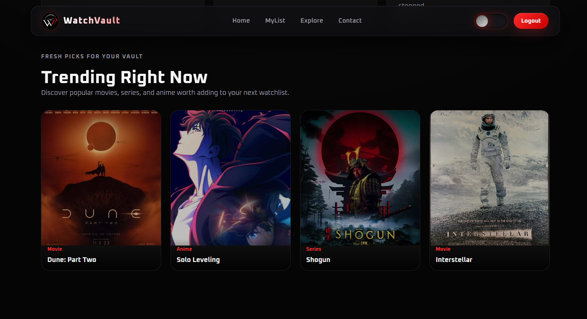
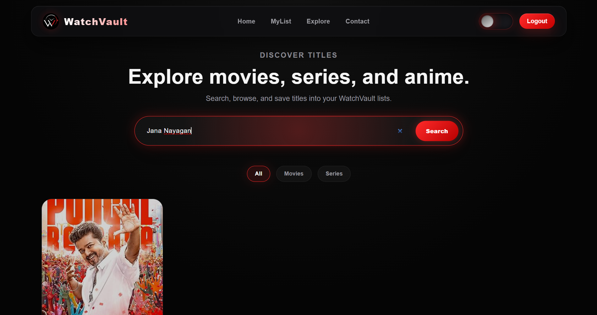

<div align="center">


# WatchVault

**Build your personal watch vault.**  
Create lists for everything you want to watch — Movies, Series, Anime.

[](https://watch-vault--joshuabaskar106.replit.app/)
[](https://nodejs.org/)
[](https://www.mongodb.com/)

[](https://developer.mozilla.org/en-US/docs/Web/HTML)
[](https://developer.mozilla.org/en-US/docs/Web/CSS)
[](https://developer.mozilla.org/en-US/docs/Web/JavaScript)

🌐 **Website:** [watch-vault--joshuabaskar106.replit.app](https://watch-vault--joshuabaskar106.replit.app/)

</div>

---

## ⚡ Built in 12 Hours — A Showcase of Talent

> *"Speed is a skill. Shipping is a skill. Doing both together is rare."*

WatchVault was designed, developed, and deployed **from scratch in under 12 hours** — a deliberate personal challenge to test real-world development ability under time pressure.

This project is not just a web app. It is a **proof of capability** from an aspiring full-stack developer who wanted to show what focused effort, clean thinking, and solid fundamentals can produce without relying on the wave of modern AI code-generation tools. The only AI assistance used during development was **ChatGPT** — for occasional lookups and rubber-duck-style reasoning, not code generation.

Every line of frontend code is handwritten in **vanilla HTML, CSS, and JavaScript** — no frontend frameworks, no UI kits, no shortcuts. The backend was built with **Node.js and Express**, with a live **MongoDB** database wired up and working within the same window. Authentication, REST API design, schema modeling, external API integration — all of it, in 12 hours.

### What this demonstrates

| Skill | Evidence |
|-------|----------|
| Frontend fundamentals | Handwritten HTML, CSS, and Vanilla JS — no React, no Tailwind, no libraries |
| Backend development | Full Express REST API with JWT auth and MongoDB integration |
| Speed & execution | Complete, deployed, working product in under half a day |
| Problem solving | External API integration, session management, and schema design under a deadline |
| Independent thinking | Built without modern AI code-gen tools — logic and architecture are entirely original |
| Full-stack thinking | Frontend, backend, database, auth, and deployment handled end-to-end |

This is what I can build on a regular day, with a timer running. Imagine what comes next.

---

## 📖 About

WatchVault is a full-stack web application for organizing your entertainment — not just tracking it. Rather than passive logging, WatchVault puts you in control through user-defined lists and flexible collection management.

Whether you're queuing up a weekend watchlist, tracking where you left off in a series, or organizing anime by season, WatchVault adapts to the way you actually watch.

> **Not a streaming platform.** WatchVault is designed purely for organizing and managing entertainment lists.

---

## 📸 Screenshots

| Home | Explore | My List |
|------|---------|---------|
|  |  |  |
|  |  |  |

---

## ✨ Features

### 🔍 Content Discovery
- Search movies, series, and anime via the **OMDb API**
- Look up titles by keyword or IMDb ID
- Browse trending content directly from the homepage

### 📋 List Management
- Create fully custom collections (e.g. *Weekend Watchlist*, *Anime Queue*, *Must Rewatch*)
- Add and remove titles freely across any list
- Track episode progress for series and anime — store season and episode details so you know exactly where you stopped

### 🔐 Authentication
- User registration and login
- Secure, stateless sessions via **JWT (JSON Web Tokens)**

### 🗄️ Persistence
- MongoDB integration via **Mongoose**
- Separate schemas for users, lists, and titles
- Per-user structured storage

---

## 🛠️ Tech Stack

| Layer | Technology |
|-------|-----------|
| Frontend | HTML, CSS, Vanilla JavaScript |
| Backend | Node.js, Express.js |
| Database | MongoDB (Mongoose ODM) |
| Auth | JSON Web Tokens (JWT) |
| External API | OMDb API |
| Hosting | Replit |

> **Note on frontend choice:** The entire UI is built with plain HTML, CSS, and JavaScript — deliberately. No React, no Vue, no component libraries. This was a conscious decision to demonstrate that strong fundamentals can produce a polished, functional product without leaning on abstractions.

---

## 🏗️ System Architecture

```
Client (HTML / CSS / JS)
         ↓
    Express REST API
         ↓
    Business Logic Layer
         ↓
    MongoDB via Mongoose
```

---

## 📁 Project Structure

```
watch-vault/
│
├── routes/
│   ├── auth.js          # Register & login endpoints
│   ├── lists.js         # List CRUD operations
│   └── savedTitles.js   # Title save/remove logic
│
├── models/              # Mongoose schemas (User, List, Title)
├── server.js            # App entry point
├── .env                 # Environment variables (not committed)
├── package.json
└── README.md
```

---

## 🚀 Getting Started

### Prerequisites
- Node.js v18+
- MongoDB Atlas account (or local MongoDB)
- OMDb API key — [get one free here](https://www.omdbapi.com/apikey.aspx)

### 1. Clone the Repository

```bash
git clone https://github.com/jbmsacps-stack/watch-vault.git
cd watch-vault
```

### 2. Install Dependencies

```bash
npm install
```

### 3. Configure Environment Variables

Create a `.env` file in the project root:

```env
MONGO_URI=your_mongodb_connection_string
API_KEY=your_omdb_api_key
JWT_SECRET=your_jwt_secret_key
```

### 4. Run the Application

```bash
node server.js
```

Visit: [http://localhost:5000](http://localhost:5000)

---

## 📡 API Reference

### Authentication

| Method | Endpoint | Description |
|--------|----------|-------------|
| `POST` | `/api/auth/register` | Register a new user |
| `POST` | `/api/auth/login` | Login and receive JWT |

### Lists

| Method | Endpoint | Description |
|--------|----------|-------------|
| `GET` | `/api/lists` | Fetch all lists for authenticated user |
| `POST` | `/api/lists` | Create a new list |
| `DELETE` | `/api/lists/:id` | Delete a list by ID |

### Saved Titles

| Method | Endpoint | Description |
|--------|----------|-------------|
| `POST` | `/api/saved` | Save a title to a list |
| `DELETE` | `/api/saved/:id` | Remove a title from a list |

### Search

| Method | Endpoint | Description |
|--------|----------|-------------|
| `GET` | `/api/search?q=keyword` | Search titles by keyword |
| `GET` | `/api/search?id=imdbID` | Fetch title by IMDb ID |

---

## 🎨 Design Philosophy

WatchVault was built with a deliberate separation between **content discovery** and **user data**, keeping the experience flexible and free of rigid tracking models.

- **API-first architecture** — clean REST endpoints designed for scalability
- **Stateless authentication** — JWT ensures no server-side session storage
- **Minimal, focused UI** — backend functionality takes priority; the interface stays out of the way
- **Separation of concerns** — Explore and Lists are architecturally independent
- **Zero framework dependency on the frontend** — HTML, CSS, and JS as they were meant to be used

---

## 🔭 Roadmap

- [ ] Episode-level tracking for series and anime
- [ ] Automated trending content updates
- [ ] Improved UI transitions and animations
- [ ] Role-based access control (Admin / User)
- [ ] Production-grade deployment (Docker / VPS)
- [ ] Public list sharing

---

## 👤 Author

**Joshua Baskar** — Aspiring Full-Stack Developer

I'm a developer passionate about building real, functional products from the ground up. WatchVault is one example of what I can put together independently — from database design to REST APIs to a handcrafted frontend — all within a tight self-imposed deadline.

If you're a recruiter, collaborator, or fellow developer, feel free to reach out. I'm always open to opportunities, feedback, and conversations about building things.

🔗 [GitHub](https://github.com/jbmsacps-stack) · [LinkedIn](https://www.linkedin.com/in/joshua-baskar-2b4a88381/) · [Live App](https://watch-vault--joshuabaskar106.replit.app/)  
📬 jbmsacps@gmail.com

---

# 📋 Copyright Notice & Usage Terms

<div align="center">

**WatchVault** · Copyright © 2026 Joshua Baskar · All rights reserved.

</div>

---

## A Note to Visitors, Developers & Collaborators

Thank you for taking the time to explore WatchVault. This project represents a significant personal investment of time, creativity, and effort. To ensure it remains protected while still being accessible to the community in a fair and respectful way, please take a moment to read the following.

---

## ✅ What You Are Welcome To Do

- **View and study** the source code for personal learning and educational purposes
- **Reference** the project in academic work, portfolios, or non-commercial writeups with clear credit given to the original author
- **Fork and experiment** privately for your own learning — this is how developers grow, and that is fully respected here
- **Share** links to this project or the live application, with proper attribution

---

## ⚠️ What Requires Prior Permission

The following actions **are not permitted** without explicit written consent from the author:

- **Publishing** this project, its code, or any substantial portion of it — whether publicly, privately, or through a third-party platform
- **Monetizing** this project in any form, including but not limited to: selling access, integrating it into a paid product, using it in a commercial service, or generating ad revenue through it
- **Redistributing** modified or unmodified versions of this codebase under a different name or identity
- **Claiming ownership** of any part of this project, its design, logic, or architecture

If you wish to use WatchVault beyond the terms above — for a commercial project, a collaborative venture, or any revenue-generating purpose — please reach out directly. Reasonable arrangements, including **royalty agreements or licensing terms**, can be discussed respectfully and fairly.

📬 **Contact:** jbmsacps@gmail.com

---

## 🤝 Fair Use

WatchVault acknowledges and respects the principle of **fair use**. Use of this project for personal education, commentary, criticism, or non-commercial research is understood to fall within fair use and is welcomed.

---

## 🌐 Coincidental Similarity Disclaimer

WatchVault was designed and developed independently, from concept to execution. Any resemblance this project may bear to any other website, application, product, or service is **entirely coincidental and unintentional**. No existing platform, product, or codebase was referenced, copied, or used as a template during development.

---

## 📊 Usage Summary

| Use Case | Permitted? |
|----------|-----------|
| Personal learning & study | ✅ Yes |
| Private forking & experimentation | ✅ Yes |
| Sharing with attribution | ✅ Yes |
| Academic reference with credit | ✅ Yes |
| Publishing publicly | ⚠️ Permission required |
| Commercial or monetized use | ⚠️ Permission + royalty agreement required |
| Redistribution under a different name | ❌ Not permitted |
| Claiming ownership | ❌ Not permitted |

---

## 📜 Legal Standing

This copyright notice constitutes a legally binding statement of ownership and usage terms. Unauthorized commercial use, redistribution, or misrepresentation of this work may be subject to applicable intellectual property and copyright law. The author reserves the right to pursue all available remedies in response to any violation of these terms.

---

<div align="center">

*Last updated: April 2026*

*WatchVault · Created by Joshua Baskar · [GitHub](https://github.com/jbmsacps-stack) · [LinkedIn](https://www.linkedin.com/in/joshua-baskar-2b4a88381/)*

⭐ If you find this project useful or impressive, consider giving it a star — it means a lot to an aspiring developer!

</div>
